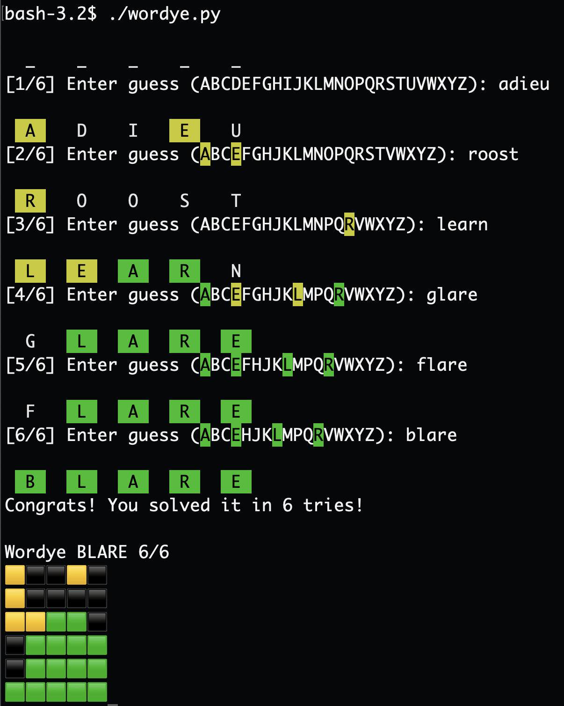

# wordye - CLI clone of Wordle

**wordye** (pronounced "wordy") is a CLI clone of the popular word game
known as [Wordle](https://www.powerlanguage.co.uk/wordle/).

## Prerequisites

To use wordye, you should have Python 3.9+ installed.

## Usage

To play a game, just run `wordye.py`. You can pass `-!` or `--hard-mode`
to play in hard mode.

There is also an AI version that will try to solve the puzzle itself.
You can experiment with that by running `ai.py`. (**NOTE:** As implemented,
the AI always plays by the hard mode rules, so there is no option to enable or
disable hard mode when playing the AI version.)

